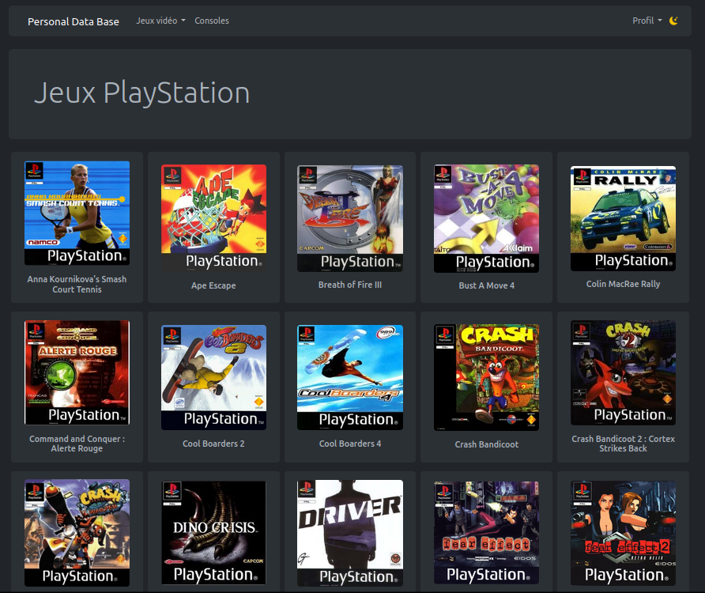
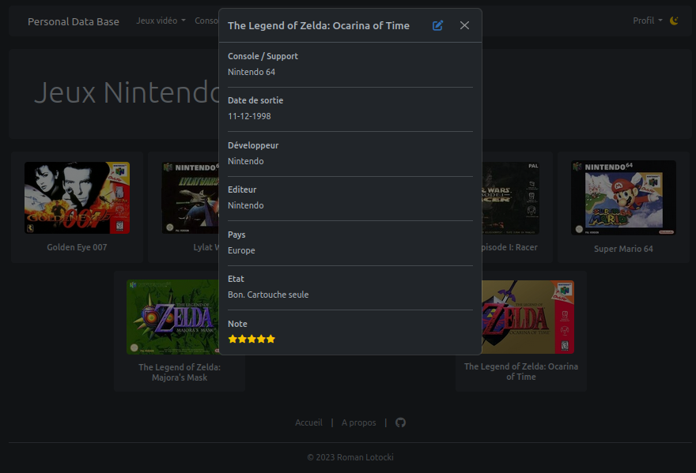
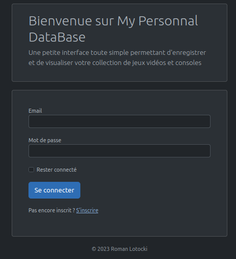

# MyPersonalDB Project

## About

Welcome to the **MyPersonalDB** repository. This project provides you with a personal and secure database to store and classify all of your video games 🎮

### Built with

* Symfony 6.3
> :memo: **Note:** Now running with Symfony 6.4.
* **UI and design:** Bootstrap 5.3 working with Webpack Encore

## Getting started

If you want to run this application locally here are the steps to follow:
> :memo: **Note:** A dockerized version will be available soon.

### Prerequisites

Make sure you have the following list installed on your system:

* PHP 8.1.0 or higher
* Composer (to run Symfony dependencies)
* Node.js (to run Webpack dependencies using npm)
* DataBase choice is up to you as long as it works with Doctrine ORM. By default, MyPersonalDB is running with MariaDB

### Installation

1. Clone this repository.

  ```sh
git clone git@github.com:RomanLotocki/personalDB.git
  ```

2. Install server-side dependencies using composer.

  ```sh
composer install
  ```

3. Install client-side dependencies using npm.

```sh
npm install
  ```
4. Build the assets as a production build.

```sh
npm run build
  ```

5. Create a `.env.local` file to configure your database with your preferences and personal informations.

6. Create the database and run migrations.

7. Run a symfony server for a smoother experience.

```sh
symfony server:start
  ```

8. Enjoy 😉

## Contact

If you have questions, comments, or want to contribute, feel free to reach me at <roman.lotocki@gmail.com> or by creating an issue on this GitHub repository.

## Screenshots




